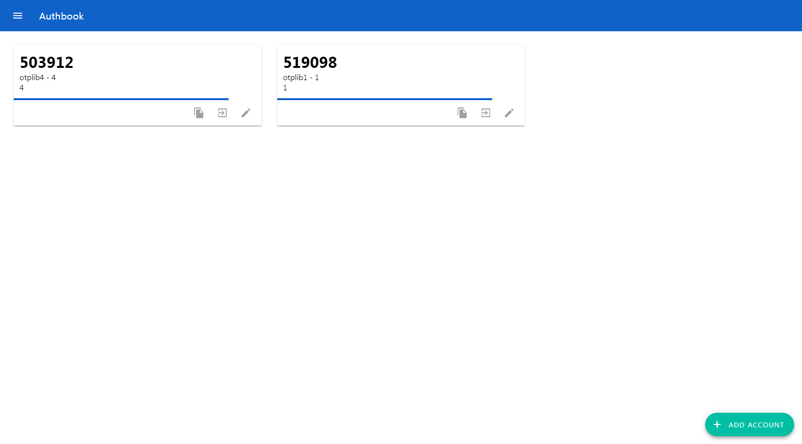
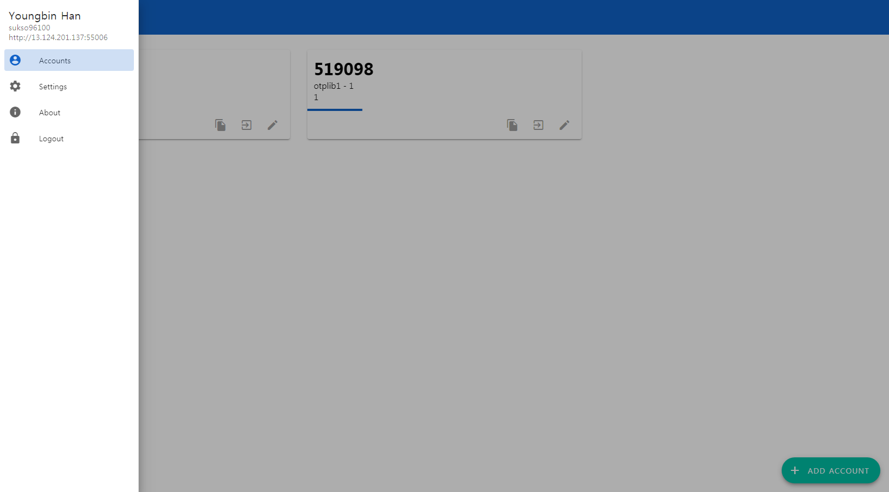
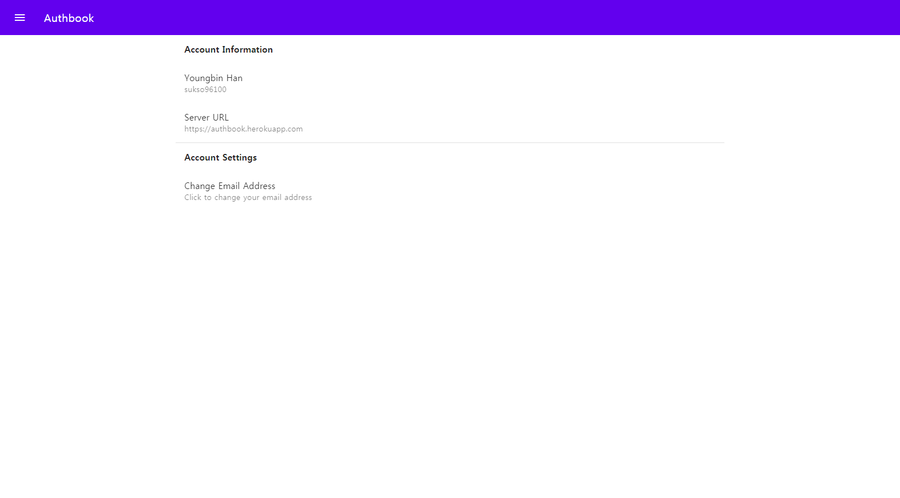

# Authbook





Authbook is a self-hosted OTP Web app software.  
The backend is built with Kotlin, Ktor and Exposed framework and the frontend is built with Javascipt, React and MDC(Material Design Components)

This project is in development stage and it isn't fullly functional yet.

- [Live demo](https://authbook.youngbin.xyz)
- [Demo video(YouTube)](https://youtu.be/AlQjdASa2EQ)

## To Do
- [x] Signup(with email verification)
- [x] Password recovery
- [x] Login
- [x] Add/Remove OTP Seed
- [x] Show list of OTP Seeds
- [x] Edit OTP Seed
- [ ] Store Seed data offline
- [ ] Localization
- [ ] Session manager
- [x] Deploy manual
- [x] Themeing
- [ ] Enable PWA

## Deploy

### Frontend

Start test server
```bash
cd frontend
npm install
npm start
```

Generate production build
```bash
cd frontend
npm install
npm build
```

### Backend
- Prepare Java and Mysql server instance
- Edit `backend/resources/application.conf` or setup environment variables(see `application.conf` for required environment variables)

Run server instantly
```
./gradlew :run
```

Build docker image(See [here](https://github.com/GoogleContainerTools/jib/tree/master/jib-gradle-plugin) for more detailed guides)
```
./gradlew jib
```
 
## Author
Youngbin Han(sukso96100@gmail.com)

## License
GNU General Public License v3.0

See [COPYING.txt](COPYING.txt) to see the full text.