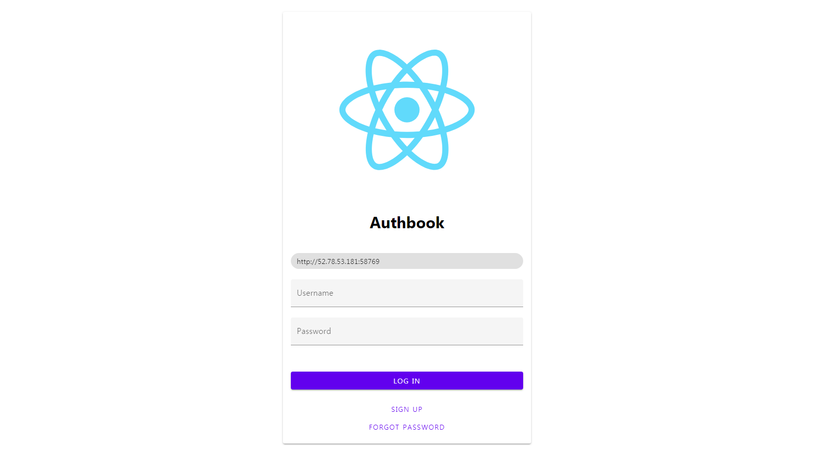
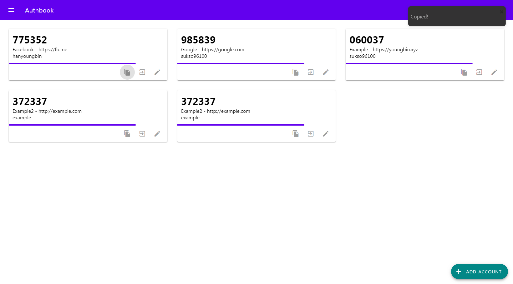

# Authbook

Authbook is a self-hosted OTP Web app software.  
The backend is built with Kotlin, Ktor and Exposed framework and the frontend is built with Javascipt, React and MDC(Material Design Components)

This project is in development stage and it isn't fullly functional yet.

## To Do
- [ ] Signup(with email verification)
- [ ] Password recovery
- [x] Login
- [x] Add/Remove OTP Seed
- [x] Show list of OTP Seeds
- [x] Edit OTP Seed
 
## Author
Youngbin Han(sukso96100@gmail.com)
